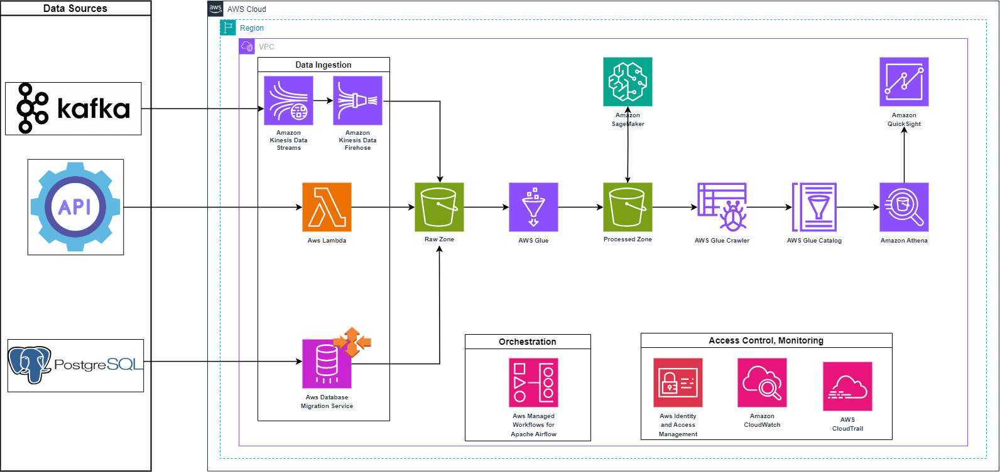

# Vessel Data Analysis Pipeline

## Overview

This document outlines the architecture of a robust data pipeline on AWS. The purpose of this pipeline is to ingest, process, and visualize data for predictive analytics, such as vessel fuel consumption, and provide operational insights into vessel movements and characteristics.

## Architecture Diagram

## Components

### Data Sources

- **Kafka**: Streams vessel position data at 15-minute intervals.
- **API**: Delivers near-real-time weather data corresponding to vessel positions.
- **PostgreSQL**: Stores vessel performance metrics and static vessel information, updated daily and weekly, respectively.

### Data Ingestion

- **Amazon Kinesis Data Streams**: Captures real-time data from Kafka for immediate processing and analysis.
- **Amazon Kinesis Data Firehose**: Facilitates the direct and automated loading of streaming data into the S3 Raw Zone.
- **AWS Lambda**: Fetches weather data from third-party APIs.
- **AWS Data Migration Services**: Utilized for ingesting data from PostgreSQL into the AWS environment.

### Data Storage

- **S3 Raw Zone**:Acts as the initial repository for ingested data. This bucket is configured with an S3 lifecycle policy to transition objects to S3 Intelligent-Tiering, which automatically moves data to the most cost-effective access tier based on how frequently the data is accessed.
- **S3 Processed Zone**: Contains data post-transformation, ready for analysis. Similarly, this bucket benefits from an S3 lifecycle policy leveraging Intelligent-Tiering to optimize storage costs while ensuring data is readily accessible for frequent analysis.

### Data Processing

- **AWS Glue**: Conducts ETL tasks, structuring raw data into analyzable formats, utilizing Delta format for efficient management of slow-changing dimensions.

### Orchestration

- **MWAA**: Provides managed workflows, orchestrating data processing tasks with Airflow.

### Data Cataloging

- **AWS Glue Catalog**: Maintains a catalog of datasets, their schema, and metadata for easy discovery and query planning.

### Analysis and Visualization

- **Amazon SageMaker**: Builds and trains predictive ML models.
- **Amazon QuickSight**: Creates interactive dashboards for data visualization.
- **Amazon Athena**: Performs SQL queries against processed data in S3.

### Access Control and Monitoring

- **IAM**: Secures access to AWS resources.
- **CloudWatch**: Offers operational insights through metrics and logs.
- **CloudTrail**: Records account activity for governance, compliance, and operational auditing.

## Data Flow

### Ingestion and Transformation

1. **Kafka to S3**:
   - Vessel position data is streamed from Kafka through Amazon Kinesis Data Streams.
   - The streamed data is then batched and loaded into the S3 Raw Zone via Amazon Kinesis Data Firehose, ensuring real-time capture and storage of position data for immediate availability.

2. **API to S3**:
   - Weather data is retrieved using AWS Lambda, which invokes third-party weather APIs.
   - Lambda functions process and transform the API response, then write the data directly into the S3 Raw Zone, allowing near-real-time weather information to be associated with vessel positions.

3. **PostgreSQL to S3**:
   - Vessel performance data and static vessel information from PostgreSQL databases are ingested using AWS Data Migration Services.
   - Tasks are scheduled to perform these tasks daily for performance data and weekly for static data, using CDC to efficiently manage updates.
   - The transformed data is placed in the S3 Processed Zone, upserted in the delta format, ready for analytics.

### Orchestration and Cataloging

4. **Workflow Management**:
   - AWS Managed Workflows for Apache Airflow (MWAA) orchestrates the sequence of ETL tasks, ensuring that data is processed and loaded at scheduled times without manual intervention.

5. **Data Discovery and Schema Management**:
   - The AWS Glue Crawler scans the data in the S3 Processed Zone to infer schemas and populate the AWS Glue Catalog.
   - This metadata repository enables data discovery for analytics and machine learning, ensuring that downstream services can query and access data with the correct structure.

### Analytics and Visualization

6. **Machine Learning Model Training**:
   - Amazon SageMaker accesses the processed data to build and train machine learning models that predict vessel fuel consumption.
   - These models are refined over time to improve accuracy and are integral to the predictive analytics component of the pipeline.

7. **Data Visualization and Querying**:
   - Amazon QuickSight utilizes the data in the AWS Glue Catalog to create interactive visualizations and dashboards, providing insights into vessel operations and performance metrics.
   - Amazon Athena is used to run ad-hoc SQL queries on the data in the S3 Processed Zone, enabling deep analysis and exploration by analysts and data scientists.

### Monitoring and Auditing

8. **Operational Oversight**:
   - Amazon CloudWatch collects metrics and logs from all the AWS services involved in the pipeline, providing a comprehensive view of the pipeline’s operational health.
   - Alarms and dashboards within CloudWatch alert the team to issues and track the performance of ETL jobs, data ingestion, and machine learning model training.

9. **Security and Compliance**:
   - AWS CloudTrail monitors and records account activity, including API calls and changes to services, ensuring an audit trail for governance and compliance purposes.

## Setup and Deployment

The deployment utilizes Terraform for infrastructure as code (IaC), enabling consistent and repeatable setups. Detailed steps include:

- Configuration of Terraform scripts to define the AWS resources.
- Initialization of Terraform and application of the configuration to provision the infrastructure.
- Configuration of IAM roles and policies to secure access to AWS services.

## Security

Security is paramount and enforced through:

- IAM roles and policies to ensure principle of least privilege.
- Encryption in transit and at rest using AWS KMS and SSL/TLS.
- Network configurations including VPCs, subnets, and security groups to safeguard data flow.

## Monitoring and Logging

Operational monitoring and logging are set up using:

- CloudWatch for metrics collection, alarms, and dashboards to visualize operational health.
- CloudTrail to log, continuously monitor, and retain account activity related to actions across the AWS infrastructure.
